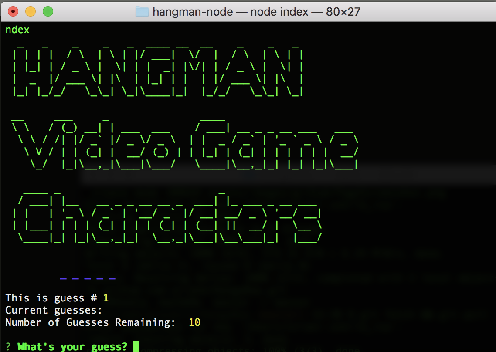

# hangman-node



# Description

A node.js terminal based Hangman game!
The topic of the game is Video Game Characters.  You will have 10 tries to guess names of popular video game characters.

# How Do I Play?

Simple!  Run the steps below to setup the game and start playing:

1. Clone this repository
2. Save the code to an easy to remember location on your machine.  For example, ```../my_node_apps/hangman-node```
3. Run ```npm install``` from the location in step 2 above
4. Run ```node index``` to launch the game

# Packages Used

* [Inquirer](https://www.npmjs.com/package/inquirer)
* [Chalk](https://www.npmjs.com/package/chalk)
* [Figlet](https://www.npmjs.com/package/figlet)
